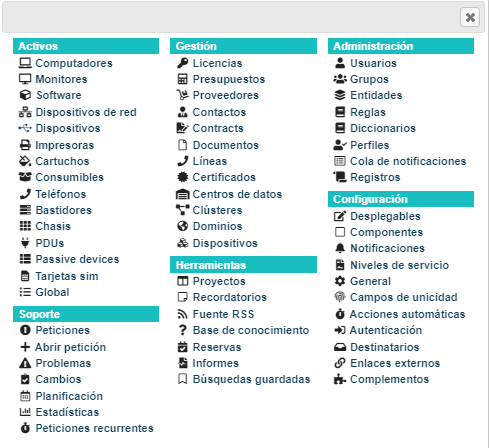
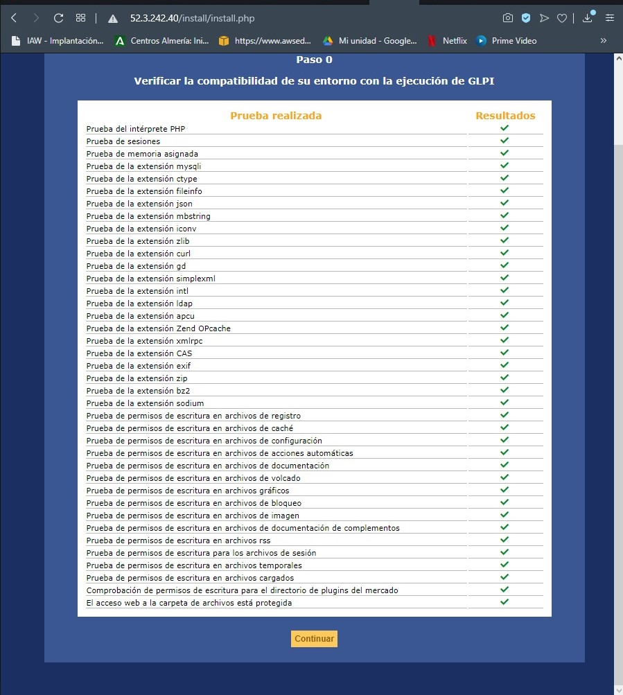

# PROYECTO INTEGRADO - GLPI


## GLPI - Gestionnaire de Parc Informatique

Es una **herramienta web** en **software libre** que ofrece una gestión integral del inventario informático de una empresa además de incluir un sistema de gestión de incidencias (ticketing / helpdesk).

La herramienta está desarrollada para entornos LAMP (Apache-PHP-MySQL), por lo que puede ser instalada tanto en **servidores Windows como Linux** y su fácil instalación y manejo permite gestionar todo el soporte y mantenimiento de una empresa de una manera rápida y sencilla, por lo que el despliegue y la puesta en marcha son bastante reducidos.

Este doble papel de gestor de inventario y helpdesk para el seguimiento de intervenciones, permite a los administradores, y al personal de soporte, vincular las intervenciones realizadas a Usuarios y a equipos, generándose así un historial completo del mantenimiento realizado.


## Técnologías utilizadas 

GLPI utiliza:

- **PHP** 5.4 o más
- **MySQL/MariaDB** para la base de datos
- **HTML** para las páginas web
- **CSS** para las hojas de estilo
- **XML** para la generación de informes


## ¿Qué nos ofrece GLPI?: 

### **- Módulo de Inventario**

Esta sección se enfoca en el control de los equipos de cómputo en general como laptops, computadoras, monitores, teléfonos, software, impresoras, cartuchos, etc. Es una base de datos donde se tiene registrado todo el equipo de la empresa.

### **- Módulo de Soporte**

En este módulo se gestionan los tickets que se tienen en el GLPI dentro de las cuales se puede generar, modificar, resolver y cerrar tickets de solicitudes que los usuarios reporten vía e-mail, telefónica o directamente, referente a elementos o equipos que tengan relación al departamento de tecnologías de la información.  También se pueden agregar avances dentro de los mismos tickets, agregar documentos y relacionarlos con más tickets con la finalidad de llevar un historial el cual pueda ser analizado.

### **- Estadística**

En esta opción vas a poder de forma estadística todos los tiquetes, problemas y cambios que han solicitado los usuarios, cuenta con un filtro y con el rango de las fechas.

### **- Módulo de Gestión**

El módulo de gestión permite a los usuarios gestionar contactos, proveedores, presupuestos, licencias, entre otros.

### **- Módulo de Administración**

Este módulo administra a los usuarios, grupos, entidades, perfiles, reglas y diccionarios. También proporciona herramientas de mantenimiento de la aplicación como la copia de seguridad de base de datos, restauración y actualización de versión.

### **- Módulo de Configuración**

Este módulo   administra   y   controla   los   parámetros   dentro   de GLPI, títulos   en   general del   sistema, notificaciones por correo, SLA, configuración en general, identificación por origen externo o directorio activo y se administran los plugin.



Esto es lo que trae por defecto en su instalación, aunque además de todo esto, GLPI tiene muchos plugins que añaden otras características: 

> - https://plugins.glpi-project.org/#/

De entre ellas los más populares son por ejemplo: 

- **FusionInventory**: Es un proyecto de código abierto y gratuito que proporciona hardware, inventario de software, implementación de software y descubrimiento de redes para la gestión de activos de TI y el software de asistencia técnica llamado GLPI.

- **FormCreator**: Permite la creación de formularios personalizados y de fácil acceso para los usuarios cuando desean crear uno o más tickets o cambios.

- **Red De Arquitectura**: Permite generar automáticamente una representación gráfica de la arquitectura de la red.

- **Informe de IP**: Permite crear informes de IP para visualizar las direcciones IP utilizadas y gratuitas en una red determinada.

En general son plugins para aumentar la variedad de inventariado dentro de la empresa. 


## INSTALACIÓN  

Se puede instalar tanto en un sistema Windows como en un sistema Linux. 

En Windown se instalarría dentro de IIS (Internet Information Server) y en Linux mediante la pila LAMP. 

Para está práctica instalaremos esta aplicación web en un servidor Linux y para ello necesitaremos instalar:

- Apache
- MySQL/MariaDB
- PHP

Además de que le podemos añadir herramientas administrativas como phpMyAdmin, Adminer, Webmin...

Podemos realizar la instalación de diferentes maneras: 

### **SCRIPT EN BASH**

Comenzaremos actualizando los repositorios y instalando la pila LAMP. 

```
#!/bin/bash

apt update -y 

apt install apache2 -y 

apt install mysql-server -y

apt install  php libapache2-mod-php php-mysql php-mbstring -y 
```

Seguidamente actualizamos la contraseña de root de MySQL y creamos la base de datos con la que conectará.

```
mysql -u root <<< "ALTER USER 'root'@'localhost' IDENTIFIED WITH caching_sha2_password BY 'root';"
mysql -u root <<< "FLUSH PRIVILEGES;"

mysql -u root  <<< "DROP DATABASE IF EXISTS db_glpi;"
mysql -u root  <<< "CREATE DATABASE user_glpi;"
mysql -u root  <<< "CREATE USER user_glpi@localhost IDENTIFIED BY 'passwd_glpi';"
mysql -u root  <<< "GRANT ALL PRIVILEGES ON db_glpi.* TO user_glpi@localhost;"
mysql -u root  <<< "FLUSH PRIVILEGES;"

```

Una vez finalizada con la instalación de la pila LAMP y creación de su base de datos podemos proceder a la instalación del GLPI.

Descargamos el archivo, descomprimimos y moveremos esos archivos a la carpeta de Apache, dentro de /var/www/html. Seguidamente daremos permisos de Apache para  evitar errores de folders 

```
wget https://github.com/glpi-project/glpi/releases/download/9.5.5/glpi-9.5.5.tgz

tar -xvzf glpi-9.5.5.tgz

mv glpi /var/www/html/

chown www-data:www-data /var/www/html/glpi/* -R

```
A continuación si accedemos dentro de nuestro navegador a la aplicación GLPI veremos que será necesario instalarle las extensiones que se encuentran pendientes, esto se hace haciendo uso del: 

```
apt-get install php-nombre_extension
```
Y para activarlas, dentro del archivo php.ini, que se encuentra dentro de /etc/php/7.2/apache2, descomentamos las líneas en donde aparezca el nombre de la extensión:

Por ejemplo: 

```
#Instalamos extensión
sudo apt-get install php-curl

#Descomentamos en el archivo
sed -i "s/;extension=curl/extension=curl/" /etc/php/7.4/apache2/php.ini
```

Finalmente para que se apliquen los cambios reiniciamos apache 

```
systemctl restart apache2
```



· CONFIGURACIÓN:

Ahora queda evitar tener agujeros de seguridad, como puede ser con el archivo .htaccess que para que surgan efecto dentro de la configuración del virtual host de apache haríamos una serie de cambios. 

```
        <Directory />
                Options FollowSymLinks
                AllowOverride None
                Require all denied
        </Directory>

        <Directory /usr/share>
                AllowOverride None
                Require all granted
        </Directory>

        <Directory /var/www/>
                Options Indexes FollowSymLinks
                AllowOverride All
                Require all granted
        </Directory>
```

- La directiva AllowOverride None implica que el fichero .htaccess no es leído.

- La directiva allow from All implica que cualquiera puede acceder a los directorios bajo www.

- La directiva Indexes implica que el contenido del directorio será mostrado.

Otra vulnerabilidad que podemos encontrar es que una vez instalado la aplicación web, este nos pide que por seguridad se elimine el archivo install/install.php para evitar que los datos sean expuestos. 


## **Docker-Compose**

Otra manera que podemos optar para la instalación de GLPI es haciendo uso de un contenedor/imagen docker-compose, que podemos encontrar en internet.

- https://hub.docker.com/r/diouxx/glpi

```
version: "3.2"

services:
#Mysql Container
  mysql:
    image: mysql:5.7.23
    container_name: mysql
    hostname: mysql
    volumes:
      - /var/lib/mysql:/var/lib/mysql
    env_file:
      - ./mysql.env
    restart: always

#GLPI Container
  glpi:
    image: diouxx/glpi
    container_name : glpi
    hostname: glpi
    ports:
      - "80:80"
    volumes:
      - /etc/timezone:/etc/timezone:ro
      - /etc/localtime:/etc/localtime:ro
      - /var/www/html/glpi/:/var/www/html/glpi
    environment:
      - TIMEZONE=Europe/Brussels
    restart: always
```

A diferencia con la instalación con script en bash es que lo mencionado anteriormente de configuraciones, extensiones php, vulnerabilidades... Nos lo ahorramos con esto, lo que hace que sea mas sencillo de desplegar. 

## GLPI Autenticación LDAP en Active Directory

Para poder comenzar a hacer inventariado necesitaremos conectarlo a un dominio, con los siguientes pasos..  

Lo primero que debemos hacer es crear una regla de Firewall en el controlador de dominio de Windows.

Esta regla de firewall permitirá que el servidor GLPI consulte la base de datos de Active Directory, en concreto el puerto TCP 389.

A continuación, necesitamos crear 1 cuenta en la base de datos de Active Directory para poder consultarla. 
Dentro de Usuarios y Equipos de Active Directory creamos esa cuenta.

Y finalmente en nuestro navegador entramos a nuestro servidor web, dentro de Configuración > Autenticación > Directorios LDAP, le damos a + para conectar GLPI con nuestro dominio Windows. 
